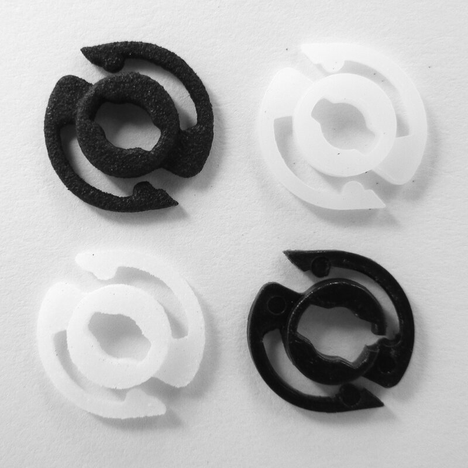

1Introduction
============

The [Lomo Supersampler][1] is an analog camera which takes four
pictures in quick succession, exposed in stripes on a single 35 mm
photo. A small part in the advance mechanism breaks easily. I think I
broke it when rewinding the film without pressing the button at the
bottom.

I then created a model of the broken part in Rhino 3D. You may find
the exported STL in this repository.

Parts were 3D printed by [WeNext][2] in:

  * Top left: HP 3D High Reusability PA 12 (black nylon, MJF)

  * Top right: Somos GP Plus 14122 (white resin, SLA)
  
  * Bottom left: FS3300PA (white nylon, SLS)
  
An earlier design Somos GP Plus 14122 part broke quickly, possibly
when rewinding the film after successfully shooting around 12
exposures before the advance mechanism got stuck.

Currently in the camera is the HP 3D High Reusability PA 12, sanded
down slightly. With a knife I scraped away a bit of the plastic on the
inside to make the part not sit too tight. I got several prints, and
the tolerances varied quite a lot.

Note that when replacing the part, it is better not to tighten the
screws of the advance mechanism’s housing too tight. Otherwise the
string won’t pull back in.

For instructions about disassembling the camera, see [Justin De La
Ornellas’][3] [Supersampler Mod][4]. Basically:

 1. Remove four screws on the outside.
  
 2. Remove two screws on the inside.
  
 3. Pull out the rewind knob.
  
 4. Press down the tiny rewind button and pull the camera mechanism
    out of the case. Be careful not to pop out the red/green indicator
    at the bottom, although it is easy to reseat.

License
=======

Except where noted otherwise, files are licensed under the WTFPL.

Copyright © 2021 [Felix E. Klee](felix.klee@inka.de)

This work is free. You can redistribute it and/or modify it under the
terms of the Do What The Fuck You Want To Public License, Version 2,
as published by Sam Hocevar. See the COPYING file for more details.

[1]: https://microsites.lomography.com/supersampler/
[2]: https://www.wenext.hk/
[3]: https://live-fts.flickr.com/photos/ornellas/
[4]: https://live-fts.flickr.com/photos/ornellas/sets/72157625111029543/
